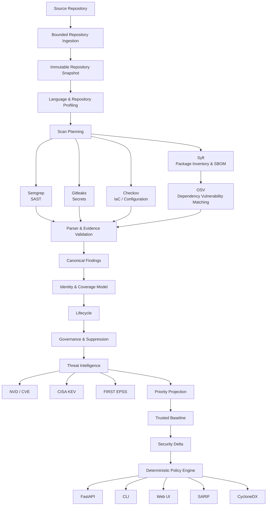

<div align="center">

# 🔐 SecureScan V2

### Evidence-Driven Source Repository Security Analysis

**SecureScan is a local-first application security platform that orchestrates multiple security engines, normalizes their evidence, enriches vulnerabilities with threat intelligence, manages security decisions over time, and produces deterministic security outcomes.**


**SAST · Secret Detection · SCA · SBOM · IaC Security · Threat Intelligence · Governance · Security Delta · Policy**

</div>

---

## Overview

Modern repositories are rarely secured by a single scanner.

A real source repository may contain application code, dependencies, infrastructure definitions, credentials, configuration files, generated assets, and multiple programming languages. Each security tool understands only part of that picture.

SecureScan provides a security analysis pipeline around those specialized tools.

Instead of simply collecting scanner output, SecureScan builds a trusted repository snapshot, determines what can be evaluated, executes appropriate security engines, validates their evidence, converts findings into a canonical model, tracks governance decisions, enriches vulnerabilities with external intelligence, compares results against trusted baselines, and produces deterministic security decisions.

The central idea is simple:

> **Scanner output is evidence, not the final security decision.**

---

## Architecture



---

## Security Capabilities

| Security Layer | Engine / Component | Purpose |
|---|---|---|
| Repository profiling | Enry | Language-aware repository analysis |
| SAST | Semgrep | Detect insecure source-code patterns |
| Secret detection | Gitleaks | Detect exposed credentials and secrets |
| Package inventory | Syft | Discover software packages and generate SBOM data |
| Dependency analysis | OSV | Match packages against known vulnerabilities |
| IaC security | Checkov | Detect insecure infrastructure and configuration |
| Vulnerability intelligence | NVD / CVE | Vulnerability metadata and severity context |
| Exploitation evidence | CISA KEV | Identify vulnerabilities known to be exploited |
| Exploit probability | FIRST EPSS | Estimate exploitation probability |
| Governance | SecureScan Core | False-positive and accepted-risk decisions |
| Suppression | SecureScan Core | Time-bounded suppression with expiry and revocation |
| Baselines | SecureScan Core | Maintain trusted historical security states |
| Security Delta | SecureScan Core | Identify meaningful security changes |
| Policy | SecureScan Core | Deterministic security decision generation |
| Interoperability | SARIF / CycloneDX | Standard security and SBOM output formats |

---

## What Makes SecureScan Different

SecureScan is deliberately not designed as a thin wrapper around several command-line scanners.

Its main engineering work happens between the scanner and the final security decision.

```text
Tool Output
    ↓
Evidence Validation
    ↓
Normalization
    ↓
Finding Identity
    ↓
Coverage Tracking
    ↓
Lifecycle
    ↓
Governance
    ↓
Threat Intelligence
    ↓
Priority
    ↓
Baseline Comparison
    ↓
Security Delta
    ↓
Policy Decision
```

This separation is important because a scanner finding, analyst decision, vulnerability intelligence record, baseline state, and policy outcome represent different types of information and should not be collapsed into a single severity field.

---

## Evidence-First Analysis

SecureScan distinguishes between what was actually evaluated and what cannot be concluded.

A scanner that fails, times out, cannot inspect a file, or does not support a language does not silently produce a clean result.

```text
No finding
≠
No vulnerability
≠
Not evaluated
≠
Scanner failure
```

Unknown or incomplete evidence remains explicit instead of being converted into false confidence.

---

## Canonical Finding Model

Different security engines describe findings differently.

SecureScan converts tool-specific results into structured findings with consistent concepts for identity, location, evidence, severity, source engine, repository lineage, lifecycle state, governance state, and prioritization.

This allows downstream components to reason about findings independently from the scanner that originally generated them.

---

## Finding Lifecycle and Governance

Security findings change over time.

SecureScan separates immutable scanner evidence from human security decisions.

Supported governance concepts include:

| Governance State | Meaning |
|---|---|
| `UNREVIEWED` | No analyst decision has been applied |
| `FALSE_POSITIVE` | Finding has been reviewed and rejected with justification |
| `ACCEPTED_RISK` | Risk has been consciously accepted with a reason and expiry |
| Revocation | Existing governance decision is withdrawn |
| Suppression | Finding is temporarily suppressed with explicit expiry |

Governance operations use revision-aware updates and maintain append-only audit history.

This prevents scanner reruns from silently rewriting analyst decisions.

---

## Suppression With Expiry

Suppressions are treated as independent security decisions rather than deleted findings.

Each suppression contains explicit justification, expiration information, revision history, and revocation state.

Expired or revoked suppressions no longer hide future findings.

---

## Effective Governance

A finding may disappear and later return.

SecureScan therefore evaluates governance decisions relative to the finding lifecycle rather than assuming that an old decision automatically applies forever.

For example, a false-positive decision made before a finding is resolved does not automatically govern a later reopened instance unless the lifecycle relationship allows it.

---

## Dependency Vulnerability Analysis

SecureScan combines software inventory from Syft with vulnerability intelligence from OSV.

```text
Repository
    ↓
Syft
    ↓
Package Observation
    ↓
PURL / Name / Version Validation
    ↓
OSV Query
    ↓
Advisory Validation
    ↓
Affected Package Binding
    ↓
Normalized Dependency Finding
```

The matching pipeline validates package identity and advisory relationships before creating a vulnerability finding.

Supported ecosystem handling includes package coordinates such as PyPI, npm, and Go where the required package identity is available.

---

## Vulnerability Intelligence

Known vulnerabilities can be enriched using several independent intelligence sources.

### NVD / CVE

Provides vulnerability metadata and severity information.

### CISA Known Exploited Vulnerabilities

Provides evidence that a vulnerability is known to have been exploited in real-world attacks.

### FIRST EPSS

Provides probabilistic estimates for exploitation activity.

SecureScan keeps these signals separate because they answer different questions.

```text
CVSS
How severe could exploitation be?

KEV
Is this vulnerability known to be actively exploited?

EPSS
How likely is exploitation activity?
```

The current `v1.5.2` release includes hardened FIRST EPSS ingestion supporting RFC3339 `score_date` timestamps while preserving compatibility with date-only values.

---

## Trusted Security Baselines

SecureScan can promote completed security analyses into trusted baselines.

A baseline represents a previously accepted security state rather than simply the immediately preceding scan.

Baseline promotion is guarded by validation rules so incomplete or unsuitable runs cannot silently become trusted reference points.

---

## Security Delta

Once a trusted baseline exists, SecureScan can evaluate the security difference between that baseline and a new candidate analysis.

Conceptually:

```text
Trusted Baseline
        +
Candidate Scan
        ↓
Finding Identity Comparison
        ↓
Lifecycle / Governance Evaluation
        ↓
Security Delta
```

This changes the question from:

> "How many findings exist?"

to:

> "What security-relevant changes occurred?"

That distinction is particularly useful for future pull-request and CI security workflows.

---

## Deterministic Security Policy

SecureScan's decision layer is deterministic.

Policy outcomes depend on explicit evidence and security state rather than opaque AI scoring.

The policy layer can distinguish successful decisions from analysis errors and incomplete evidence.

```text
Evidence
   ↓
Governance
   ↓
Threat Intelligence
   ↓
Priority
   ↓
Security Delta
   ↓
Policy
   ↓
PASS / FAIL / ERROR
```

The same validated input produces the same decision.

---

## Local-First Security

SecureScan was designed around controlled source processing.

Repository analysis begins from a bounded snapshot rather than allowing scanners unrestricted access to arbitrary paths.

External intelligence integrations send the minimum required vulnerability or package identifiers rather than repository source code.

The platform also keeps scanner execution, normalized evidence, governance decisions, and external intelligence as separate trust boundaries.

---

## Technology Stack

| Layer | Technologies |
|---|---|
| Core platform | Python |
| API | FastAPI |
| Persistence | PostgreSQL |
| Language intelligence | Go / Enry |
| SAST | Semgrep |
| Secret scanning | Gitleaks |
| SBOM / package discovery | Syft |
| Dependency vulnerabilities | OSV |
| IaC security | Checkov |
| Vulnerability intelligence | NVD, CVE, CISA KEV, FIRST EPSS |
| Containerization | Docker / Docker Compose |
| Database migrations | Alembic |
| Security interchange | SARIF, CycloneDX |
| Testing | Pytest |
| Python quality | Ruff |

---

## Quick Start

The project was developed and validated in Linux / WSL2 environments.

Clone the repository:

```bash
git clone https://github.com/saimani21/Secure-scanV2.git
cd Secure-scanV2
```

Create and activate a virtual environment:

```bash
python -m venv .venv
source .venv/bin/activate
```

Install the project and PostgreSQL development dependencies:

```bash
python -m pip install -e '.[dev,postgres]'
```

Create the local environment configuration:

```bash
cp .env.example .env
```

Initialize SecureScan:

```bash
./.venv/bin/securescan init
```

Configure the local system:

```bash
./.venv/bin/securescan system configure --from-env-file .env
```

Validate the environment:

```bash
./.venv/bin/securescan doctor
```

Start the SecureScan system:

```bash
./.venv/bin/securescan system up
```

Check service status:

```bash
./.venv/bin/securescan system status
```

Open the application:

```bash
./.venv/bin/securescan open
```

---

## Running a Repository Scan

After creating a SecureScan project through the CLI or API, a source repository can be submitted using:

```bash
./.venv/bin/securescan scan /absolute/path/to/repository \
  --project-id <project-uuid>
```

SecureScan will profile the repository, determine applicable security engines, execute the analysis pipeline, normalize evidence, persist findings, and expose the resulting security state.

---

## API

SecureScan exposes application functionality through FastAPI.

When running the standard local deployment, API readiness can be checked using:

```bash
curl http://127.0.0.1:8000/health/ready
```

FastAPI also provides interactive API documentation when enabled by the application configuration.

---

## Development

Run the Python test suite:

```bash
python -m pytest
```

Run static checks:

```bash
python -m ruff check .
```

Check formatting:

```bash
python -m ruff format --check .
```

Database migrations are managed with Alembic:

```bash
alembic upgrade head
alembic current
alembic check
```

---

## Current Release

```text
SecureScan Source v1.5.2
Tag:    source-v1.5.2
Commit: 4c1f0969cb16bfc9e548eeb701b61ab0cb788626
```

`v1.5.2` is a compatibility hardening release for FIRST EPSS ingestion.

It accepts RFC3339 timestamps in EPSS `score_date` values while retaining compatibility with date-only values and preserving the existing intelligence contract.

---

## Design Principles

| Principle | SecureScan Approach |
|---|---|
| Evidence before conclusions | Scanner output is validated before becoming trusted evidence |
| Unknown is not clean | Missing evaluation is represented explicitly |
| Separation of concerns | Evidence, governance, intelligence, and policy remain distinct |
| Reproducibility | Security decisions use deterministic inputs |
| Auditability | Governance decisions preserve historical events |
| Conservative correlation | Findings are correlated only when identity evidence supports it |
| Local-first analysis | Source processing remains controlled and bounded |
| Explicit coverage | Unsupported or incomplete analysis is visible |

---

## What SecureScan Is Not

SecureScan is a source-repository security analysis platform.

It does not claim that static analysis proves an application secure.

It does not replace dynamic application security testing, penetration testing, runtime monitoring, cloud runtime detection, or manual security review.

It also does not automatically treat every scanner result as an exploitable vulnerability.

The goal is to make security evidence more trustworthy, explainable, reproducible, and useful.

---

## Project Direction

SecureScan's architecture is designed to support later development in areas such as pull-request security analysis, CI security gates, dependency reachability, VEX-aware dependency decisions, validated container-security profiles, organization-level security views, and carefully bounded assistance for remediation.

These capabilities are future directions and are not presented as functionality of the current `v1.5.2` release.

---

## Author

**Sai Mani Kumar Pemmanaboina**

Cyber Security  
National Forensic Sciences University, Gandhinagar

GitHub: [@saimani21](https://github.com/saimani21)

---

<div align="center">

### SecureScan

**From scanner output to defensible security decisions.**

</div>
